# Database Documentation

This document provides an overview of the database schema for the project, including the Entity Relationship Diagram (ERD) and detailed table descriptions.

## Entity Relationship Diagram (ERD)

```mermaid
erDiagram
    %% Core & Localization
    LOCALES {
        int id PK
        string code
        string name
    }

    %% Authentication
    USERS {
        int id PK
        string name
        string email
        string password
    }

    ADMINS {
        int id PK
        string name
        string email
    }

    CUSTOMERS {
        int id PK
        string name
        string email
    }

    %% Catalog Module
    CATEGORIES {
        int id PK
        int parent_id
        int position
        boolean status
        json additional
    }

    CATEGORY_TRANSLATIONS {
        int id PK
        int category_id FK
        string locale
        string name
        string slug
        text description
    }

    PRODUCTS {
        int id PK
        string sku
        string type
        boolean status
        int parent_id FK
        int attribute_family_id FK
        json additional
        decimal cost_price
    }

    PRODUCT_CATEGORIES {
        int product_id FK
        int category_id FK
    }

    TAGS {
        int id PK
        string name
        string slug
    }

    PRODUCT_TAGS {
        int product_id FK
        int tag_id FK
    }

    PRODUCT_INVENTORIES {
        int id PK
        int product_id FK
        int qty
    }

    PRODUCT_IMAGES {
        int id PK
        int product_id FK
        string path
        string type
        int position
    }

    PRODUCT_FLAT {
        int id PK
        string sku
        string name
        text description
        string url_key
        boolean new
        boolean featured
        boolean status
        string thumbnail
        decimal price
        decimal weight
        int product_id FK
        int parent_id FK
        string locale
    }

    PRODUCT_ATTRIBUTE_VALUES {
        int id PK
        int product_id FK
        int attribute_id FK
        string locale
        text text_value
        boolean boolean_value
        integer integer_value
        decimal float_value
        datetime datetime_value
        date date_value
        json json_value
    }

    PRODUCT_RELATIONS {
        int parent_id FK
        int child_id FK
    }

    PRODUCT_SUPER_ATTRIBUTES {
        int product_id FK
        int attribute_id FK
    }

    PRODUCT_REVIEWS {
        int id PK
        string name
        string title
        int rating
        text comment
        string status
        int product_id FK
        int customer_id FK
    }

    %% Attribute Module
    ATTRIBUTES {
        int id PK
        string code
        string admin_name
        string type
        boolean is_required
        boolean is_unique
        boolean is_filterable
        boolean is_configurable
    }

    ATTRIBUTE_FAMILIES {
        int id PK
        string code
        string name
        boolean status
    }

    ATTRIBUTE_GROUPS {
        int id PK
        int attribute_family_id FK
        string name
        int position
    }

    ATTRIBUTE_GROUP_MAPPINGS {
        int attribute_id FK
        int attribute_group_id FK
    }

    ATTRIBUTE_OPTIONS {
        int id PK
        int attribute_id FK
        string admin_name
        int sort_order
    }

    %% Relationships
    CATEGORIES ||--o{ CATEGORY_TRANSLATIONS : "translated into"
    PRODUCTS }o--o{ CATEGORIES : "belongs to"
    PRODUCTS }o--o{ TAGS : "has"
    PRODUCTS ||--o{ PRODUCT_INVENTORIES : "has"
    PRODUCTS ||--o{ PRODUCT_IMAGES : "has"
    PRODUCTS ||--o{ PRODUCT_ATTRIBUTE_VALUES : "has values"
    PRODUCTS ||--o{ PRODUCT_REVIEWS : "has"
    PRODUCTS ||--o{ PRODUCT_SUPER_ATTRIBUTES : "has configurable"
    PRODUCTS ||--o{ PRODUCT_RELATIONS : "has variants/related"
    
    ATTRIBUTES ||--o{ PRODUCT_ATTRIBUTE_VALUES : "defines data for"
    ATTRIBUTES ||--o{ ATTRIBUTE_OPTIONS : "has predefined"
    ATTRIBUTES }o--o{ ATTRIBUTE_GROUPS : "mapped to via ATTRIBUTE_GROUP_MAPPINGS"
    
    ATTRIBUTE_FAMILIES ||--o{ ATTRIBUTE_GROUPS : "contains"
    ATTRIBUTE_FAMILIES ||--o{ PRODUCTS : "assigned to"
    
    CUSTOMERS ||--o{ PRODUCT_REVIEWS : "writes"
    LOCALES ||--o{ PRODUCT_FLAT : "defines localization for"
    LOCALES ||--o{ CATEGORY_TRANSLATIONS : "defines localization for"
    LOCALES ||--o{ PRODUCT_ATTRIBUTE_VALUES : "defines localization for"
    PRODUCTS ||--o{ PRODUCT_FLAT : "represented in"
```

## Table Descriptions

### Catalog Module

| Table | Description |
|-------|-------------|
| `categories` | Stores the hierarchy and settings of product categories (using NestedSet). |
| `category_translations` | Localized content for categories (name, slug, description). |
| `products` | Core product information including SKU, type, status, and cost price. |
| `product_categories` | Pivot table linking products to multiple categories. |
| `product_inventories` | Tracks stock levels for each product. |
| `product_images` | Stores paths and types of images associated with products. |
| `product_flat` | Flattened product data (including prices and cost) for optimized reading. |
| `product_attribute_values` | EAV (Entity-Attribute-Value) storage for dynamic product data. |
| `product_relations` | Defines relationships like variants, up-sells, and cross-sells. |
| `product_super_attributes` | Maps configurable attributes to parent products. |
| `product_reviews` | Customer ratings and comments for products. |
| `tags` | Simple tagging system for products (e.g., 'New', 'Sale'). |
| `product_tags` | Pivot table linking products to multiple tags. |

### Attribute Module

| Table | Description |
|-------|-------------|
| `attributes` | Definitions for various product properties (text, select, etc.). |
| `attribute_families` | Templates for products, defining which attributes are available. |
| `attribute_groups` | Organizes attributes within an attribute family for better UI representation. |
| `attribute_group_mappings` | Links specific attributes to attribute groups. |
| `attribute_options` | Predefined values for attributes of type 'select' or 'multiselect'. |

### Core & Auth

| Table | Description |
|-------|-------------|
| `locales` | Supported languages and locales in the system. |
| `users` | General system users. |
| `admins` | Administrative users for the backend panel. |
| `customers` | Registered customers in the frontend. |
